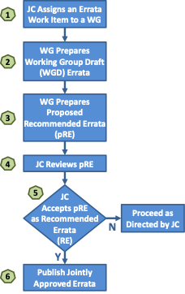

<!-- markdownlint-enable require-heading-body -->

# Processes {.body}

This section contains the processes of the NTCIP project.

Each process has the following outline:

*   Section Number and Title – The title is not to be excessively long.
*   Effective Date – Date when the process took effect.
*   Approved By – Typically the NTCIP Coordinator or the NTCIP JC.
*   Process Contact – The point of contact when the process needs to change. The point of contact is to be one of the project rolls identified in Section 1.5.
*   Supersedes – Title and date of any processes superseded by this process.
*   Last Reviewed/Updated – Date when the process was last reviewed or updated.
*   Applies To – The project rolls of those the process applies to.
*   History – History of major changes to the process.
*   Related Processes – Processes that have a related concern or are causally connected.
*   Process Statement – State the process.

Definitions of terms and acronyms used in the policies are included in Section 1.5 and Section 1.6, respectively.

## NTCIP Standards Development Process {.body}

**Effective Date:** September 30, 2017

**Approved By:** NTICP Joint Committee

**Process Contact:** NTCIP Coordinator

**Supersedes:** N/A

**Last Reviewed/Updated:** September 30, 2017

**Applies To:** NTCIP Joint Committee and Working Groups

**History:** None

**Related Processes:** None

**Process Statement:**

In concept, the process of creating a standard is straightforward: a specification undergoes a period of development and several iterations of review and revision, is approved (or adopted) as a standard by the appropriate body, and is published. In practice, the process is more complicated, due to:

1.  the difficulty of creating specifications of high technical quality;
2.  the need to consider the interests of all of the affected parties;
3.  the importance of establishing widespread community consensus; and
4.  the difficulty of evaluating the utility of a particular specification.

The goals of the NTCIP Standards Process are:  

1.  technical excellence;
2.  clear, concise, and easily understood documentation;
3.  openness and fairness; and
4.  meeting needs within the ITS community.

The goals of technical excellence and the need to allow all interested parties to comment on work items require significant time and effort. On the other hand, today's rapid development of technology demands the timely development of standards. The NTCIP standards process is intended to balance these conflicting goals. The process is believed to be as short and simple as possible without unduly sacrificing technical excellence or openness and fairness.

From its inception, the NTCIP project has been, and is expected to remain, an evolving family of standards whose participants regularly factor new requirements and technology into its design and implementation. Users of NTCIP standards and providers of the equipment, software, and services that support it should anticipate and embrace this evolution as a major tenet of NTCIP philosophy.

The NTCIP standards development process is shown in Figure 2. It includes steps of increasing levels of review and endorsement. Within each level, there are also several steps related to specific activities that take place.

### Step 1 – JC Assigns a Standards Work Item to a WG {.body}

A standards activity begins with a proposal submitted to the NTCIP JC for consideration (see Procedure 5.2 NTCIP JC Proposals). Typically, a proposal comes from an existing WG but it may come from other sources such as a member of the NTCIP JC, an SDO, or the USDOT. If the JC chooses to go forward with the proposal, a work item is identified (see Policy 3.2 NTCIP Document Classifications) and assigned to an appropriate WG. If no appropriate WG exists, a new working group may be formed (see Procedure 5.1.1 Creating an NTCIP Working Group). Once the work item is assigned to a WG and any preconditions for the proposal are met, then the proposal is approved and work may begin.

### Step 2 – WG Prepares Working Group Draft (WGD) Standards {.body}

After a proposal has been approved, the WG begins the task of creating draft standards for internal use by the WG. Typically, a paid consultant or consulting team performs this work. However, the work may also be done on a volunteer basis by WG members.

Early WGD standards may not be complete, may only address certain features or areas of the standard, and may not be in an NTCIP standard format (see NTCIP 8002). As the WG continues with its development, a WGD standard will take on the NTCIP standard format and the necessary sections of the standard are drafted.

### Step 3 – WG Prepares Proposed User Comment Draft (pUCD) Standard {.body}

Once a WGD standard is substantially complete, the WG may take a vote to advance the WGD standard to the NTCIP JC as a pUCD standard. To qualify as a pUCD standard, the standard must adhere to NTCIP 8002 and have all major technical issues addressed. If a vote on a pUCD standard fails, the WG may continue to work on the standard and votes retaken until pUCD standard is achieved.

### Step 4 – JC Reviews pUCD {.body}

The pUCD standard is distributed to the NTCIP JC for review by the members. Members should formulate comments and questions prior to a NTCIP JC meeting with the WG Chair.

### Step 5 – JC Accepts pUCD as User Comment Draft (UCD) Standard {.body}

A meeting, web conference or teleconference is held where the WG Chair (and possibly a technical lead in the project) presents the pUCD standard to the members of the NTCIP JC. The NTCIP JC asks the presentation team questions and makes comments based on their review. Any issue may be discussed regarding the pUCD standard. The NTCIP JC may take a vote to advance the pUCD as a User Comment Draft (UCD) standard. To qualify as UCD standard, the document must relate to an approved proposal and submitted by the authorized WG. If a vote on a UCD standard fails, the NTCIP will provide direction on how to proceed. This direction may be to simply correct editorial items in the standard prior to a revote or there may be some more significant development to be done. When the NTCIP JC votes to accept the pUCD as a UCD, it is advanced to the SDOs.

### Step 6 – SDOs Distribute UCD for Review and Solicits Comments {.body}

The NTCIP SDOs distribute the UCD standard to the members of their organizations and the UCD standard is posted on the NTCIP Web Site. A user comment period is identified and comments on the UCD standard are solicited. A user comment period must not be less than 30 calendar days.

### Step 7 – WG Collects and Resolves Comments {.body}

During the user comment period, the WG collects all comments received whether the source of a comment is from a user or otherwise. Comments may be sent directly to the WG or forwarded through SDO Staff to the WG. The comments may be editorial, technical, simple or substantial in nature.

The WG adjudicates each comment submitted during the user comment period. A comment may be “rejected” if it is the consensus of the WG that the comment was not proper or appropriate. Some of the reasons that a comment may be rejected are that the WG may disagree technically with the proposed change, the WG may decide that the proposed change is out of scope for the standard being developed, or the comment may not be suitable because of other corrective actions taken by the WG. A comment is “accepted” when it is the consensus of the WG that the suggested change or issue is appropriate. Often, comments submitted include suggested changes to the text of the standard. Such changes are taken as recommendations but the WG may accept the comment but modify the corrective measures suggested. The adjudications of the comments are posted on the NTCIP Web Site, sent back to the commenters or both.

### Step 8 – WG Prepares Proposed Recommended Standard (pRS) {.body}

Based on the adjudication of comments from the user comment period, the WG updates the standard accordingly. Once the standard is substantially complete, the WG may take a vote to advance the standard to the NTCIP JC as a pRS. If a vote on a pRS standard fails, the WG may continue to work on the standard and votes retaken until pRS is achieved.

### Step 9 – JC Reviews pRS {.body}

The pRS is distributed to the NTCIP JC for review by the members. Members should formulate comments and questions prior to a NTCIP JC meeting with the WG Chair.

### Step 10 – JC Accepts pRS as RS {.body}

A meeting, web conference or teleconference is held where the WG Chair (and possibly a technical lead in the project) presents the pRS to the members of the NTCIP JC. The NTCIP JC asks the presentation team questions and makes comments based on their review. Any issue may be discussed regarding the pRS. The NTCIP JC may take a vote to advance the pRS as a Recommended Standard (RS). To qualify as an RS, the document must relate to an approved proposal and submitted by the authorized WG. If a vote on an RS fails, the NTCIP JC will provide direction on how to proceed. This direction may be to simply correct items in the standard prior to a revote or there may be some more significant development to be done. When the NTCIP JC votes to accept the pRS as an RS, it is advanced to the SDOs.

### Step 11 – SDOs Distribute RS for Review {.body}

The NTCIP SDOs distribute the RS to the members of their organizations and the RS standard is posted on the NTCIP Web Site. The RS review period must not be less than 30 calendar days. This review is part of the approval (or ballot) process.

### Step 12 – NTCIP SDOs Approve Standard {.body}

Each SDO has their own approval (or ballot) process used within their organization. The SDOs may allow “ballot comments” to be submitted during the review that must be adjudicated by the WG and their resolution approved by the NTCIP JC. The SDOs may provide an opportunity for individuals to make an appeal against the approval of a standard. Resolution of an appeal may also require actions from the WG or NTCIP JC. Once all three NTCIP SDOs approve (or adopt) the standard, the standard is considered a Joint Standard of AASHTO, ITE and NEMA.

### Step 13 – Publish Jointly Approved Standard {.body}

The standard is updated with any final editorial corrections. It is posted on the NTCIP Web Site by the NTCIP Coordinator.

<figure markdown>

<figcaption>Figure 2: Standards development process</figcaption>
</figure>

## NTCIP Errata Development Process {.body}

| **Effective Date**     | September 30, 2017                     |
|------------------------|----------------------------------------|
| **Approved By**        | NTICP Joint Committee                  |
| **Process Contact**    | NTCIP Coordinator                      |
| **Supersedes**         | N/A                                    |
| **Last Reviewed/Updated** | September 30, 2017                  |
| **Applies To**         | NTCIP Joint Committee and Working Groups |
| **History**            | None                                   |
| **Related Processes**  | None                                   |

### Process Statement {.body}

Once a standard is developed and published, deployments of the standard in devices and systems will uncover errors and ambiguities in the standard not foreseen prior to publication. In order to correct such issues and facilitate future deployments of the standard, an errata document may be developed and published. An abbreviated process compared to that of the standards development process is used. An errata document developed for a standard is not required to go through a user comment period or through an SDO ballot or approval. However, the NTCIP JC may require a user comment period if the corrective measures in the errata are extensive or complicated. See Figure 3.

### Step 1 – JC Assigns an Errata Work Item to a WG {.body}

A standards activity begins with a proposal submitted to the NTCIP JC for consideration (see Procedure 5.1.2 NTCIP JC Proposals). Typically, a proposal comes from an existing WG but it may come from other sources such as a member of the NTCIP JC, an SDO, or the USDOT. If the JC chooses to go forward with the proposal, a work item is identified (see Policy 3.2 NTCIP Document Classifications) and assigned to an appropriate WG. Once the work item is assigned to a WG and any preconditions for the proposal are met, then the proposal is approved and work may begin.

### Step 2 – WG Prepares Working Group Draft (WGD) Errata {.body}

After a proposal has been approved, the WG begins the task of creating draft errata for internal use by the WG. Typically, a paid consultant or consulting team performs this work. However, the work may also be done on a volunteer basis by WG members.

### Step 3 – WG Prepares Proposed Recommended Errata (pRE) {.body}

Once the errata document is substantially complete, the WG may take a vote to advance the errata to the NTCIP JC as a pRE. If a vote on a pRE document fails, the WG may continue to work on the errata and votes retaken until a pRE errata is achieved.

### Step 4 – JC Reviews pRE {.body}

The pRE is distributed to the NTCIP JC for review by the members. Members should formulate comments and questions prior to a NTCIP JC meeting with the WG Chair.

### Step 5 – JC Accepts pRE as an RE {.body}

A meeting, web conference or teleconference is held where the WG Chair (and possibly a technical lead in the project) presents the pRE to the members of the NTCIP JC. The NTCIP JC asks the presentation team questions and makes comments based on their review. Any issue may be discussed regarding the pRE. The NTCIP JC may take a vote to advance the pRE as a Recommended Errata (RE). If a vote on an RE fails, the NTCIP JC will provide direction on how to proceed. This direction may be to simply correct items in the errata prior to a revote or there may be some more significant development to be done. When the NTCIP JC votes to accept the pRE as an RE, it is qualified for publication.

### Step 6 – Publish Jointly Approved Errata {.body}

The errata document is updated with any final editorial corrections. It is posted on the NTCIP Web Site by the NTCIP Coordinator.

<figure markdown>

<figcaption>Figure 3: Errata development process</figcaption>
</figure>

