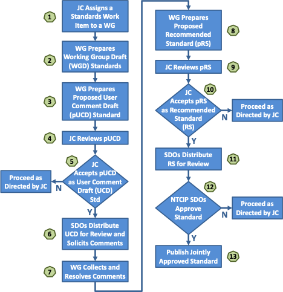

<!-- markdownlint-enable require-heading-body -->

# Processes {.body}

## Organizational Processes {.body}

### Organization Overview {.body}

The NTCIP effort is a joint effort of three Standards Development Organizations (SDOs): the American Association of State Highway and Transportation Officials (AASHTO), the Institute of Transportation Engineers (ITE), and the National Electrical Manufacturers Association (NEMA). The overall effort is managed by an NTCIP Coordinator and overseen by the Joint Committee on the NTCIP (JC), which consists of 6 representatives from each SDO. The JC establishes working groups (WGs) to develop standards and other documents per defined processes. The JC can also establish long-term advisory groups (AGs) and short-term ad-hoc groups (AHGs) to provide advice on specific topics.

Participation in the NTCIP effort is open to anyone who has a vested interest in Intelligent Transportation Systems, including infrastructure operators/owners, producers (e.g., device manufactures and central system providers), and general interest users (e.g., consultants, academics, and others). Each group (e.g., JC, WG, AG, AHG) is led by a chair that is responsible for calling meetings and leading discussions. Other key participants include document editors and liaisons.

The responsibilities for each of these entities are described in the following clauses.

### Standards Development Organizations {.body}

|**Parameter**              |**Value**                               |
|---------------------------|----------------------------------------|
|**Effective Date:**        |September 30, 2026                      |
|**Approved By:**           |NTCIP Joint Committee                   |
|**Policy Contact:**        |NTCIP Coordinator                       |
|**Supersedes:**            |N/A                                     |
|**Last Reviewed/Updated:** |September 30, 2026                      |
|**Applies To:**            |NTCIP Joint Committee and Working Groups|
|**History:**               |None                                    |
|**Related Policies:**      |None                                    |

#### Assignment {.body}

SDO membership within the NTCIP is predicated upon joint agreement among all participating SDOs.

#### Responsibilities {.body}

Each of the three SDO members of the NTCIP effort is responsible for:

1. Establishing the necessary Memorandum of Understandings among the SDOs
2. Establishment of Joint Committees and scope
3. Appointing members to the Joint Committees and coordinating with other SDOs to ensure balance
4. Appointing the NTCIP Coordinator
5. Coordination of technical work among SDOs and among Joint Committees
6. Consideration of appeals

#### Termination

Rules for an SDO to terminate its participation within the NTCIP are defined in the joint agreement among participating SDOs.

### NTCIP Coordinator {.body}

|**Parameter**              |**Value**                               |
|---------------------------|----------------------------------------|
|**Effective Date:**        |September 30, 2026                      |
|**Approved By:**           |NTCIP Joint Committee                   |
|**Policy Contact:**        |NTCIP Coordinator                       |
|**Supersedes:**            |N/A                                     |
|**Last Reviewed/Updated:** |September 30, 2026                      |
|**Applies To:**            |NTCIP Joint Committee and Working Groups|
|**History:**               |None                                    |
|**Related Policies:**      |None                                    |

#### Assignment {.body}

The NTCIP Coordinator is appointed through mutual agreement among the SDOs.

#### Responsibilities {.body}

The NTCIP Coordinator is responsible for:

1. Managing projects
    - Advertising work and managing consultants, if needed
    - Ensuring continued progress of work and updates to status on websites
    - Ensuring projects follow defined processes and procedures
    - Managing comments and responses
2. Announcing meetings with agendas
3. Ensuring that documents are processed in a timely manner once submitted to the SDOs for UCD, ballot, or publication
4. Maintain membership roles for each NTCIP group ensuring that members are fulfilling the requirements of membership
5. Setting up meetings
6. Assisting JC chair as needed
7. Maintaining all necessary records for projects
8. Maintaining a written record of all decisions made at JC and WG meetings

#### Termination {.body}

The NTCIP Coordinator can be replaced at any time through mutual agreement among the SDOs.

### Joint Committee on the NTCIP {.body}

|**Parameter**              |**Value**                               |
|---------------------------|----------------------------------------|
|**Effective Date:**        |September 30, 2026                      |
|**Approved By:**           |NTCIP Joint Committee                   |
|**Policy Contact:**        |NTCIP Coordinator                       |
|**Supersedes:**            |N/A                                     |
|**Last Reviewed/Updated:** |September 30, 2026                      |
|**Applies To:**            |NTCIP Joint Committee and Working Groups|
|**History:**               |None                                    |
|**Related Policies:**      |None                                    |

#### Assignment {.body}

The Joint Committee is established by the Memorandum of Understanding among the SDOs.

#### Responsibilities {.body}

The JC is responsible for:

1. Approving the policies, processes and procedures of the NTCIP
2. Approving new projects with appropriate details, as appropriate
3. Approving the formation of new groups (e.g., working groups) under the NTCIP JC
4. Approving recommendations from sub-groups, as appropriate

#### Quorum {.body}

Quorum is established by a simple majority of the current voting membership.

#### Voting {.body}

In general, the NTCIP JC operates on a consensus basis. However, when needed to resolve conflicts and when required by adopted procedures, the NTCIP JC will undertake formal votes. Unless otherwise stated in detailed processes, decisions by the JC are made by simple majority of those voting (i.e., more than half of the votes cast) when a quorum is available. Voting by correspondence is allowed and abstentions are considered in quorum determination but are not considered in the simple majority determination.

#### Termination {.body}

A member of the NTCIP JC can resign at any time. The voting membership of the NTCIP JC can revoke the voting membership of any member by a 2/3rds vote of all current voting members. Upon resignation or termination of any voting member, the associated SDO should take immediate steps to find a replacement voting member.

!!! question
    Do we need to say anything about the following or is it up to each SDO to handle:

    - Lapsing membership (e.g., due to inactivity)
    - Reinstating membership

### Groups {.body}

|**Parameter**              |**Value**                               |
|---------------------------|----------------------------------------|
|**Effective Date:**        |September 30, 2026                      |
|**Approved By:**           |NTCIP Joint Committee                   |
|**Policy Contact:**        |NTCIP Coordinator                       |
|**Supersedes:**            |N/A                                     |
|**Last Reviewed/Updated:** |September 30, 2026                      |
|**Applies To:**            |NTCIP Joint Committee and Working Groups|
|**History:**               |None                                    |
|**Related Policies:**      |None                                    |

#### Types of Groups {.body}

!!! question
    The current NTCIP structure does not seem to allow for sub-groups other than WGs. The recent task force demonstrated the need for such a group. The following is based on the ISO structure. Is it appropriate?

Within the NTCIP effort, most work is performed within groups. The NTCIP JC can establish three types of groups:

1. **Working Groups** are formed for the task of developing one or more documents (e.g., standards, informational reports) to be published by the NTCIP.
2. **Advisory Groups** are long-term groups formed to provide guidance and recommendations to the JC on issues that continually evolve (e.g., planning).
3. **Ad-hoc Groups** are short-term groups formed to provide guidance and recommendations to the JC on specific issues that arise.

!!! note
    Advisory and ad-hoc groups provide advice to the NTCIP JC. This advice is often delivered in the form of an internal written report. Development of documents for publication are required to be prepared by working groups to ensure that they are properly vetted by interested parties.

#### Establishment of groups {.body}

Groups are established by a majority vote of the NTCIP JC. Upon initial establishment, whenever membership falls below thresholds, and whenever a dormant group is reactivated, the NTCIP Coordinator is responsible for publicizing the action to promote membership within the group.

#### Responsibilities {.body}

Each group is responsible for its scope as defined by the JC. When there is active work within the group, the group is responsible for reporting to the JC regarding its current schedule and progress made as well as reporting any issues that have arisen and making formal recommendations for any JC action that needs to be taken.

#### Quorum {.body}

To establish a quorum, a group will have:

1. Representation from a minimum of two members from each membership category applicable to the group and
2. At least 50% of the voting membership participation from the average of the previous three meetings

!!! question
    This makes administration of the WG more challenging, perhaps 67% of the participation from the previous meeting?

A group that does not have, on its roster, at least two members from each applicable membership category will be considered inactive.

#### Voting {.body}

Each group generally operates by consensus; for example, issues about the text of a draft standard are discussed if there are no sustained objections to the revised text, the discussion can move to the next topic without any formal vote. This promotes speedy development; nonetheless, a member can use Robert's Rules to ask for a vote on the issue to document the level of consensus, if they wish. While most discussions are by consensus, key decisions defined in the development process require formal votes to unambiguously document the level of consensus achieved prior to moving the document to the next stage.

There is no maximum number of members for any membership category, but formal votes are weighted to ensure equal voting representation from each of the three membership categories, per ANSI requirements of balance.

!!! example
    If a vote includes 3 producers, each producer's vote will count as 11.11% of the vote total, regardless of how many users or general interest voters are present.

#### Terminating groups {.body}

At any time, the NTCIP JC can suspend or terminate a group by a simple majority vote.

### JC Chair {.body}

|**Parameter**              |**Value**                               |
|---------------------------|----------------------------------------|
|**Effective Date:**        |September 30, 2026                      |
|**Approved By:**           |NTCIP Joint Committee                   |
|**Policy Contact:**        |NTCIP Coordinator                       |
|**Supersedes:**            |N/A                                     |
|**Last Reviewed/Updated:** |September 30, 2026                      |
|**Applies To:**            |NTCIP Joint Committee and Working Groups|
|**History:**               |None                                    |
|**Related Policies:**      |None                                    |

#### Assignment {.body}

!!! question "Discussion"
    From the MOU (although we have never operated like this): The committee shall designate a chair and vice-chair which shall be from different organizations. The chair shall have a term limit of 3 consecutive years.  After the 3-year term the vice-chair shall become chair, and a new vice chair shall be designated from the remaining organization that didn’t have a leadership role during the previous term.

==???==

#### Responsibilities {.body}

The JC chair is responsible for:

1. Acting on behalf of the full NTCIP effort (not the chair's employer)
2. Guiding the NTCIP Coordinator
3. Ensuring projects are moving forwards
4. Calling JC meetings
5. Presiding over NTCIP JC meetings
    - Ensuring that important topics are included in the agenda
    - Pursuing goal of establishing consensus on important issues
    - Ensuring that all concerns are properly considered by the committee in a balanced manner
    - Ensuring that all committee decisions are properly formulated and captured
6. Appointing chairs of each established group
7. Ensuring established processes are followed
8. Ensuring the establishment of a long-term plan for the NTCIP effort

#### Termination {.body}

The NTCIP JC chair can resign at any time. The NTCIP chair can be replaced at the end of the three year term or by a 2/3rds vote of the NTCIP JC voting membership.

### NTCIP JC Members {.body}

|**Parameter**              |**Value**                               |
|---------------------------|----------------------------------------|
|**Effective Date:**        |September 30, 2026                      |
|**Approved By:**           |NTCIP Joint Committee                   |
|**Policy Contact:**        |NTCIP Coordinator                       |
|**Supersedes:**            |N/A                                     |
|**Last Reviewed/Updated:** |September 30, 2026                      |
|**Applies To:**            |NTCIP Joint Committee and Working Groups|
|**History:**               |None                                    |
|**Related Policies:**      |None                                    |

#### Assignment {.body}

Voting members of the JC are appointed by the SDOs with six members appointed by each of the three SDOs, for a total of 18 voting member positions. Membership within the NTCIP JC is assigned to an individual, but that individual may designate a single alternate member from the same organization to represent the assigned member's position if the assigned member is unavailable.  It is the responsibility of the SDOs to coordinate among each other to ensure balance among these members, including that no single organization is represented by more than a single voting membership.

!!! question
    Do we allow alternates, and if so, is it by company?

!!! question
    Is there a term duration or term limits?

#### Responsibilities {.body}

NTCIP JC members are responsible for participating in meetings, participating in discussions within the JC, casting votes, and informing the NTCIP Coordinator of any changes to their contact or employment information.

#### Terminating group membership {.body}

A member of the NTCIP JC can resign or be removed by the nominating SDO at any time.

### NTCIP Group Members {.body}

|**Parameter**              |**Value**                               |
|---------------------------|----------------------------------------|
|**Effective Date:**        |September 30, 2026                      |
|**Approved By:**           |NTCIP Joint Committee                   |
|**Policy Contact:**        |NTCIP Coordinator                       |
|**Supersedes:**            |N/A                                     |
|**Last Reviewed/Updated:** |September 30, 2026                      |
|**Applies To:**            |NTCIP Joint Committee and Working Groups|
|**History:**               |None                                    |
|**Related Policies:**      |None                                    |

#### Member Assignment {.body}

!!! question
    One of the challenges that we have had to date is handling membership. Further, as I reviewed various documents, I realized that we do not currently conform to ANSI requirements for balance (especially for safety-related standards). We currently only divide between public and private sector - at best achieving 50% balance - and have no mechanism to ensure balanced voting - i.e., while membership is balanced, voting can be highly skewed. Further, there has been significant problems in achieving quorum at times, which has resulted in significant delays in voting. This is even true on groups where voting membership was based on attendance at early meetings only to see active members become inactive due to other work commitments. Finally, there have been complaints voiced about some active non-voting members not being allowed to register their dissenting votes on documents. The following proposal (membership, quorum, and voting) is an attempt to overcome these challenges while trying to keep the spirit of the existing structure as much as possible.

    Is this appropriate? Do we need to add any additional safe-guards (e.g., should it still be considered a quorum if only 6 people show up to a meeting if the group had an average of 30 at its 3 previous meetings?)

Membership within each NTCIP group is by organization (i.e., the employer of the group member). For each group, each member is assigned to one of the following membership categories:
    - Producer (i.e., manufacturer of the relevant device or third party provider)
    - User (i.e., infrastructure operators and owners)
    - General Interest (i.e., neither of the above), including
        - Integrators (including any SNMP manager, but excluding manufacturers)
        - Academics
        - Cybersecurity experts
        - Consultants
        - Testers
        - Others
    - Observer (i.e., any non-voting entity)

Membership categories for an organization can vary by group (e.g., an ASC manufacturer would be a manufacturer on the ASC WG but could be general interest for the RSU WG if they do not manufacturer RSUs) but changing the membership category of an organization within a WG requires a 2/3rds majority vote of the WG voters present.

Membership within WGs must remain balanced with one-third representation each from producers, users, and general interest. Membership in AGs and AHGs default to the same one-third rule, but, because they do not directly work on products for public consumption, can be more flexible at the direction of the JC, as deemed appropriate. For example, an ad-hoc group focused on gaining feedback from public agencies regarding education needs could be limited the "user" category.

Membership within any group (exclusive of the JC) is open to any organization with an vested interest in ITS. Each organization shall designate a primary representative to cast its votes; alternates can be designated as well to ensure representation when the primary member is not present. Organizations can elect to be observers, in which case, they are not included in votes.

#### Responsibilities {.body}

Members are responsible for participating in meetings, participating in discussions within the group, casting votes, and informing the NTCIP Coordinator of any changes to their contact or employment information.

#### Terminating group membership {.body}

A (organizational) member of an NTCIP group can resign at any time. A member who misses five consecutive meetings can be removed from membership roles (but can be re-instated by simply attending a meeting).

!!! note
    Removing members from roles is primarily a task to ensure that a group is still viable.

### Group Co-Chairs {.body}

|**Parameter**              |**Value**                               |
|---------------------------|----------------------------------------|
|**Effective Date:**        |September 30, 2026                      |
|**Approved By:**           |NTCIP Joint Committee                   |
|**Policy Contact:**        |NTCIP Coordinator                       |
|**Supersedes:**            |N/A                                     |
|**Last Reviewed/Updated:** |September 30, 2026                      |
|**Applies To:**            |NTCIP Joint Committee and Working Groups|
|**History:**               |None                                    |
|**Related Policies:**      |None                                    |

#### Assignment {.body}

!!! question
    If we shift WG membership to one of three categories, should we do the same for chairs? NOTE: ANSI balance requires nor more than a third from any one category for safety standards.

The NTCIP JC chair appoints one private-sector and one public-sector co-chair to each NTCIP group. The dual-chair structure is designed to improve the balance of discussions while also allowing meetings to be conducted when one chair might have a conflict. The co-chairs are responsible for:

#### Responsibilities {.body}

1. Acting on behalf of the full NTCIP effort (not the co-chair's employer)
2. Reporting to the NTCIP JC
3. Ensuring projects are moving forwards
4. Calling group meetings
5. Presiding over group meetings
    - Ensuring that important topics are included in the agenda
    - Pursuing goal of establishing consensus on important issues
    - Ensuring that all concerns are properly considered by the group in a balanced manner
    - Ensuring that all group decisions are properly formulated and captured
6. Ensuring established processes are followed
7. Ensuring the development of a long-term plan for the group to be recommended to the JC

#### Termination {.body}

A chair of an NTCIP group can resign at any time. The NTCIP JC Chair can remove the chair from the role at any time.

### Editors {.body}

|**Parameter**              |**Value**                               |
|---------------------------|----------------------------------------|
|**Effective Date:**        |September 30, 2026                      |
|**Approved By:**           |NTCIP Joint Committee                   |
|**Policy Contact:**        |NTCIP Coordinator                       |
|**Supersedes:**            |N/A                                     |
|**Last Reviewed/Updated:** |September 30, 2026                      |
|**Applies To:**            |NTCIP Joint Committee and Working Groups|
|**History:**               |None                                    |
|**Related Policies:**      |None                                    |

#### Assignment {.body}

Every NTCIP document (draft or published) is assigned a primary editor by the NTCIP Coordinator.

#### Responsibilities {.body}

The editor is responsible for consolidating all of the comments received to date into a coherent document that conforms with the NTCIP format as defined in [NTCIP 8002](https://ite-org.github.io/NTCIP-8002/). The editor is also responsible for the following, per the processes and procedures defined in this document:

1. Managing written comments received,
2. Formulating draft responses,
3. Facilitating discussions on the comments and draft responses,
4. Submitting the final comments with resolutions to the NTCIP Coordinator, and
5. Developing any required standards development report package.

#### Termination

The NTCIP Coordinator can remove the editor at any time.

!!! question
    Can/should the editor be a voting member?

### Maintainer {.body}

|**Parameter**              |**Value**                               |
|---------------------------|----------------------------------------|
|**Effective Date:**        |September 30, 2026                      |
|**Approved By:**           |NTCIP Joint Committee                   |
|**Policy Contact:**        |NTCIP Coordinator                       |
|**Supersedes:**            |N/A                                     |
|**Last Reviewed/Updated:** |September 30, 2026                      |
|**Applies To:**            |NTCIP Joint Committee and Working Groups|
|**History:**               |None                                    |
|**Related Policies:**      |None                                    |

#### Assignment

For online development projects, the NTCIP Coordinator must assign a maintainer. The maintainer can be the editor.

#### Responsibilities {.body}

The maintainer is responsible for the tasks defined for this role in [NTCIP 8008](https://ite-org.github.io/NTCIP-8008/). The maintainer is responsible for the management of the online environment and does not need to necessarily be a subject matter expert in relation to the standard; rather the maintainer must be familiar with GitHub operations to ensure that the online environment remains useful, that those submitting comments receive timely acknowledgement, and must coordinate with the editor to ensure subject matter issues are resolved.

#### Termination

The NTCIP Coordinator can remove the maintainer at any time.

!!! question
    Can/should the maintainer be a voting member?

|**Parameter**              |**Value**                               |
|---------------------------|----------------------------------------|
|**Effective Date:**        |September 30, 2026                      |
|**Approved By:**           |NTCIP Joint Committee                   |
|**Policy Contact:**        |NTCIP Coordinator                       |
|**Supersedes:**            |N/A                                     |
|**Last Reviewed/Updated:** |September 30, 2026                      |
|**Applies To:**            |NTCIP Joint Committee and Working Groups|
|**History:**               |None                                    |
|**Related Policies:**      |None                                    |

### Liaison {.body}

Liaisons are members of a group that have been formally designated to be responsible for reporting to and/or reporting from an external organization that is relevant to the group's discussion. The formal designation often facilitates sharing information between groups.

|**Parameter**              |**Value**                               |
|---------------------------|----------------------------------------|
|**Effective Date:**        |September 30, 2026                      |
|**Approved By:**           |NTCIP Joint Committee                   |
|**Policy Contact:**        |NTCIP Coordinator                       |
|**Supersedes:**            |N/A                                     |
|**Last Reviewed/Updated:** |September 30, 2026                      |
|**Applies To:**            |NTCIP Joint Committee and Working Groups|
|**History:**               |None                                    |
|**Related Policies:**      |None                                    |

### Observer {.body}

!!! question
    It seems to me that this does not formally exist at present, but I think this is the practice, yes?

NTCIP JC meetings are open to any party with a vested interest in ITS that contacts the NTCIP Coordinator in advance. The NTCIP Coordinator will maintain a list of observers and has the discretion to remove observers from meetings for cause or to remove observers from the list if they have not participated in recent meetings. Observers have no formal status or rights at meetings and are considered guests at the meetings.

## NTCIP Development Process {.body}

|**Parameter**              |**Value**                               |
|---------------------------|----------------------------------------|
|**Effective Date:**        |September 30, 2017                      |
|**Approved By:**           |NTCIP Joint Committee                   |
|**Policy Contact:**        |NTCIP Coordinator                       |
|**Supersedes:**            |N/A                                     |
|**Last Reviewed/Updated:** |September 30, 2026                      |
|**Applies To:**            |NTCIP Joint Committee and Working Groups|
|**History:**               |None                                    |
|**Related Policies:**      |None                                    |

### Process Statement {.body}

#### Overview {.body}

In concept, the process of creating a standard is straightforward: a specification undergoes a period of development and several iterations of review and revision, is approved (or adopted) as a standard by the appropriate body, and is published. In practice, the process is more complicated, due to:

1. the difficulty of creating specifications of high technical quality;
2. the need to consider the interests of all of the affected parties;
3. the importance of establishing widespread community consensus; and
4. the difficulty of evaluating the utility of a particular specification.

#### Goals {.body}

The goals of the NTCIP Standards Process are:  

1. technical excellence;
2. clear, concise, and easily understood documentation;
3. openness and fairness; and
4. meeting needs within the ITS community.

The goals of technical excellence and the need to allow all interested parties to comment on work items require significant time and effort. On the other hand, today's rapid development of technology demands the timely development of standards. The NTCIP standards process is intended to balance these conflicting goals. The process is believed to be as short and simple as possible without unduly sacrificing technical excellence or openness and fairness.

From its inception, the NTCIP project has been, and is expected to remain, an evolving family of standards whose members regularly factor new requirements and technology into its design and implementation. Users of NTCIP standards and providers of the equipment, software, and services that support it should anticipate and embrace this evolution as a major tenet of NTCIP philosophy.

~~The NTCIP standards development process is shown in Figure 2. It includes steps of increasing levels of review and endorsement. Within each level, there are also several steps related to specific activities that take place.~~

### Document Approval Processes

#### Overview

The NTCIP has three approval processes resulting in different levels of standardization as presented below. The three processes mainly differ in the number of iterations that are required and who approves the final document, whereas the [Steps](#process-steps-body) required within the process are consistent among the processes.

#### NTCIP Interim for Field Release (IFR)

The IFR process does not include a distinct user comment stage; instead, it requires the use of the [online development process](https://ite-org.github.io/NTCIP-8008/) to gather comments during drafting.

1. Assign a standards work item to a WG with an IFR target
2. If new major version
    1. WG drafts document
    2. WG reviews document
    3. WG approves document as pIFR
    4. JC reviews document
    5. JC approves document as IFR
3. If minor version
    1. WG revises document
    2. WG reviews document
    3. WG approves document as IFR
    4. JC can rescind minor version
4. If patch
    1. WG Editorial Team revises document
    2. WG reviews document
    3. WG Editorial Team approves document as IFR
    4. WG can rescind patch
5. SDO Publishes as IFR

#### NTCIP JC Recommended Standard (JRS)

1. Assign a standards work item to a WG with a JRS target
2. WG drafts document
3. WG approves document as pUCD
4. JC reviews document
5. JC approves document as UCD
6. SDOs distribute UCD
7. WG collects and resolves comments
8. WG revises document
9. WG approves document as pJRS
10. JC reviews document
11. JC approves document as JRS
12. SDO publishes as JRS

#### NTCIP Standard

1. Assign a standards work item to a WG with a full standard target
2. WG drafts document
3. WG approves document as pUCD
4. JC reviews document
5. JC approves document as UCD
6. SDOs distribute UCD
7. WG collects and resolves comments
8. WG drafts document
9. WG approves document as pJRS
10. JC reviews document
11. JC approves document as JRS
12. SDO publishes as JRS
13. SDO distributes for review
14. SDOs approve as full standard
15. SDO publishes as full standard

<figure markdown>

<figcaption>Figure 2: Standards development process</figcaption>
</figure>

### ~~Process~~ Steps {.body}

#### JC Assigns a Standards Work Item to a WG {.body}

A standards activity begins with a proposal submitted to the NTCIP JC for consideration (see Procedure 5.2 NTCIP JC Proposals). Typically, a proposal comes from an existing WG but it may come from other sources such as a member of the NTCIP JC, an SDO, or the USDOT. If the JC chooses to go forward with the proposal, a work item is identified (see Policy 3.2 NTCIP Document Classifications) and assigned to an appropriate WG. If no appropriate WG exists, a new working group may be formed (see Procedure 5.1.1 Creating an NTCIP Working Group). Once the work item is assigned to a WG and any preconditions for the proposal are met, then the proposal is approved and work may begin.

#### WG ^^Drafts Document^^ ~~Prepares Working Group Draft (WGD) Standards~~ {.body}

~~After a proposal has been approved, the WG begins the task of creating draft standards for internal use by the WG.~~ ^^The WG is responsible for building consensus and developing the draft document.^^ ~~Typically,~~ ^^Often,^^ a paid consultant or consulting team ~~performs this work~~ ^^serves as the editor; although,^^ ~~. However,~~ the work may also be done on a volunteer basis by WG members.

Early ~~WGD standards~~ ^^drafts^^ may not be complete, may only address certain features or areas of the standard, and may not be in an NTCIP standard format (see NTCIP 8002). As the WG continues with its development, ~~a WGD standard~~ ^^the document^^ will take on the [NTCIP standard format](https://ite-org.github.io/NTCIP-8002/) and the necessary sections of the standard are drafted.

^^The work to develop this draft can either follow the traditional process (e.g., using Word documents) or follow the online process described in [NTCIP 8008](https://ite-org.github.io/NTCIP-8008/).^^

#### WG ~~Prepares Proposed User Comment Draft (pUCD) Standard~~ Approves Document for Next Stage {.body}

~~Once a WGD standard is substantially complete, the WG may take a vote to advance the WGD standard to the NTCIP JC as a pUCD standard.~~ ^^^^Once a WG has consensus on the document and the document conforms to NTCIP 8002, it takes a vote to advance the document to its next stage (e.g., pUCD, pRS, pIFR, or IFR)^^. ~~To qualify as a pUCD standard, the standard must adhere to NTCIP 8002 and have all major technical issues addressed.~~ If ~~a vote on a pUCD standard~~ ^^the vote^^ fails, the WG ~~may~~ ^^will need to^^ continue ~~to~~ working on the ~~standard and votes retaken until pUCD standard~~ ^^document until consensus^^ is achieved.

#### JC Review {.body}

^^If the document requires JC review, it^^ ~~The pUCD standard~~ is distributed to the NTCIP JC ^^membership.^^ ~~for review by the members.~~ Members should formulate comments and questions ^^with the WG Chair^^ prior to ~~a~~ ^^the subsequent^^ NTCIP JC meeting ~~with the WG Chair~~.

When the document is distributed for review, it must identify its associated approved work item and the WG that prepared the document.

#### JC Accepts ^^Document for Next Stage^^ ~~pUCD as User Comment Draft (UCD) Standard~~ {.body}

A meeting, web conference or teleconference is held where the WG Chair (and possibly a technical lead in the project) presents the ~~pUCD standard~~ ^^document^^ to the members of the NTCIP JC. The NTCIP JC asks the presentation team questions and makes comments based on their review. Any issue may be discussed regarding the ~~pUCD standard~~ ^^document^^. The NTCIP JC may take a vote to advance the ~~pUCD as a User Comment Draft (UCD) standard~~ ^^document to its next stage (e.g., UCD or IFR). ~~To qualify as UCD standard, the document must relate to an approved proposal and submitted by the authorized WG.~~ The vote can include direction to correct editorial errors with the document.

If ^^the^^ ~~a~~ vote ~~on a UCD standard~~ fails, the NTCIP ^^JC^^ will provide direction on how to proceed. This direction ^^will typically indicate what revisions are required to make document acceptable to the NTCIP JC.^^ ~~may be to simply correct editorial items in the standard prior to a re-vote or there may be some more significant development to be done.When the NTCIP JC votes to accept the pUCD as a UCD, it is advanced to the SDOs.~~

#### SDOs Distribute ~~UCD for Review and Solicits Comments~~ {.body}

^^Once a document has been approved for the next stage, the^^ ~~The~~ NTCIP SDOs ^^update the document (i.e., showing its new status) and ^^ distribute the ~~UCD standard~~ ^^document^^ to the members of their organizations and the ~~UCD standard~~ ^^document^^ is posted on the ^^designated website.^^ ~~NTCIP Web Site.~~

^^If the document is a UCD, a^^ ~~A~~ user comment period is identified and comments on the UCD standard are solicited. A user comment period must not be less than 30 calendar days.

#### WG Collects and Resolves Comments {.body}

^^In addition to internal WG discussions, the WG is responsible for collecting and resolving written comments from the larger industry community. These comments frequently include comments from WG membership performing detailed reviews of the document at key points during the development cycle. The WG can collect these comments in one of two ways:^^

- ^^In the traditional standards development process, the NTCIP JC approves a UCD, which represents a substantially complete draft, with a defined commenting period. All written comments received during this period are carefully managed and formal responses are prepared. Comments may be sent directly to the WG or forwarded through SDO Staff to the WG.^^
- ^^In the online standards development process, the document is always available online and its associated GitHub environment allows for the submission of comments at any time. These comments and responses are managed by the GitHub environment automatically.^^

~~During the user comment period, the~~ ^^The^^ WG collects all comments received whether the source of a comment is from a user or otherwise. ~~Comments may be sent directly to the WG or forwarded through SDO Staff to the WG.~~ The comments may be editorial, technical, simple or substantial in nature.

The WG adjudicates each comment submitted~~ during the user comment period~~. A comment may be “rejected” if it is the consensus of the WG that the comment was not proper or appropriate. Some of the reasons that a comment may be rejected are that the WG may disagree technically with the proposed change, the WG may decide that the proposed change is out of scope for the standard being developed, or the comment may not be suitable because of other corrective actions taken by the WG. A comment is “accepted” when it is the consensus of the WG that the suggested change or issue is appropriate. Often, comments submitted include suggested changes to the text of the standard. Such changes are taken as recommendations but the WG may accept the comment but modify the corrective measures suggested. The adjudications of the comments are posted on the ~~NTCIP Web Site~~ ^^designated website^^, sent back to the commenter(s) or both.

#### ~~WG Prepares Proposed Recommended Standard (pRS)~~ {.body}

~~Based on the adjudication of comments from the user comment period, the WG updates the standard accordingly. Once the standard is substantially complete, the WG may take a vote to advance the standard to the NTCIP JC as a pRS. If a vote on a pRS standard fails, the WG may continue to work on the standard and votes retaken until pRS is achieved.~~

#### ~~JC Reviews pRS~~ {.body}

~~The pRS is distributed to the NTCIP JC for review by the members. Members should formulate comments and questions prior to a NTCIP JC meeting with the WG Chair.~~

#### ~~JC Accepts pRS as RS~~ {.body}

~~A meeting, web conference or teleconference is held where the WG Chair (and possibly a technical lead in the project) presents the pRS to the members of the NTCIP JC. The NTCIP JC asks the presentation team questions and makes comments based on their review. Any issue may be discussed regarding the pRS. The NTCIP JC may take a vote to advance the pRS as a Recommended Standard (RS). To qualify as an RS, the document must relate to an approved proposal and submitted by the authorized WG. If a vote on an RS fails, the NTCIP JC will provide direction on how to proceed. This direction may be to simply correct items in the standard prior to a re-vote or there may be some more significant development to be done. When the NTCIP JC votes to accept the pRS as an RS, it is advanced to the SDOs.~~

#### ~~SDOs Distribute RS for Review~~ {.body}

~~The NTCIP SDOs distribute the RS to the members of their organizations and the RS standard is posted on the NTCIP Web Site. The RS review period must not be less than 30 calendar days. This review is part of the approval (or ballot) process.~~

#### NTCIP SDOs Approve ~~Standard~~ ^^Document^^ {.body}

Each SDO has their own approval (or ballot) process used within their organization. The SDOs may allow “ballot comments” to be submitted during the review that must be adjudicated by the WG and their resolution approved by the NTCIP JC. The SDOs may provide an opportunity for individuals to make an appeal against the approval of a standard. Resolution of an appeal may also require actions from the WG or NTCIP JC. Once all three NTCIP SDOs approve (or adopt) the standard, the standard is considered a Joint Standard of AASHTO, ITE and NEMA.

#### Publish Jointly Approved ~~Standard~~ ^^Document^^ {.body}

The standard is updated with any final editorial corrections. It is posted on the ~~NTCIP Web Site~~ designated website by the NTCIP Coordinator.

