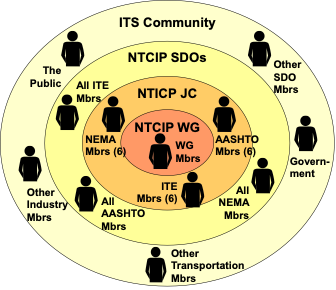

# Withdrawn and Superseded Items {.annex}

## NTCIP Consensus-Based Organization {.annex}

|**Parameter**              |**Value**                               |
|---------------------------|----------------------------------------|
|**Effective Date:**        |September 30, 2017                      |
|**Approved By:**           |NTCIP Joint Committee                   |
|**Policy Contact:**        |NTCIP Coordinator                       |
|**Superseded By:**         |Openness, Lack of Dominance, Balance, Consideration of Views and Objections, Evidence of Consensus|
|**Withdrawn On:**          |September 30, 2026                      |
|**Applies To:**            |NTCIP Joint Committee and Working Groups|
|**History:**               |None                                    |
|**Related Policies:**      |None                                    |

### Policy Statement {.annex}

The AASHTO, ITE and NEMA develop and issue standards that are widely accepted and deployed in the transportation field, particularly as they apply to transportation infrastructure, traffic management and control procedures, and electronic traffic control equipment. In 1996, they established a MOU for the formation and operation of the NTCIP JC (see Section 1.4 References). The NTCIP JC is made up of 18 voting members with one-third (1/3) each being designated by AASHTO, ITE and NEMA. Non-voting members of the NTCIP JC may include staff representatives from each of the SDOs (SDO Staff), liaison representatives from the USDOT and other liaison representatives as identified by the Chair of the NTCIP JC.

The purpose of the NTCIP project is to develop and maintain the NTCIP family of standards which are designed to achieve interoperability between transportation management centers and transportation field equipment and between transportation management centers and central systems of various types.

To accomplish this, the NTCIP project employs a consensus-based organizational structure that provides for layers of stakeholder review, comment collection and resolution, and acceptance (see Figure 1.).

!!! question
    Is it worth keeping the figure?

<figure markdown>

<figcaption>Figure 1: Consensus-based organization for the development of NTCIP standards</figcaption>
</figure>

Central to the NTCIP consensus organization are the Working Groups which function under the oversight of the NTCIP JC to perform the technical work of developing and maintaining NTCIP standards and related documents. These WGs are created and tasked with work items by the NTCIP JC. WGs may be made up of consultants, manufacturers, software providers, public transportation professionals, users, and even those in industries not traditionally considered transportation. Membership in one of the NTCIP SDOs is not a requirement to be a member in a WG. The NTCIP JC oversees the activities of the WGs, reviews work items produced by the WG, and determines if the work items are suitable for distribution through the memberships of the NTCIP SDOs. The SDOs of the NTCIP project still retain their individual internal standards approval (or adoption) processes. Once all three NTCIP SDOs have approved an NTCIP standard, the standard is said to be “Jointly Approved.” The ITS Community represents those who are largely beneficiaries of NTCIP standards who are not already included in the other layers.

## NTCIP Document Classifications {.annex}

| **Effective Date**     | September 30, 2017                     |
|------------------------|----------------------------------------|
| **Approved By**        | NTICP Joint Committee                  |
| **Policy Contact**     | NTCIP Coordinator                      |
| **Supersedes**         | N/A                                    |
| **Last Reviewed/Updated** | September 30, 2017                  |
| **Applies To**         | NTCIP Joint Committee and Working Groups |
| **History**            | None                                   |
| **Related Policies**   | None                                   |

### Policy Statement {.annex}

~~There are a variety of document types covered by the NTCIP efforts, including:~~

1.  ~~Standards;~~
2.  ~~Errata;~~
3.  ~~Process, Control, and Information Management Policies; and~~
4.  ~~Informational Reports.~~

### Standards {.annex}

~~The primary activity of the NTCIP project effort is to develop standards. NTCIP Standards include those documents that define specific requirements related to protocols, data definitions, message set definitions, etc. and that are developed and maintained in a committee environment. Standards are divided into Base Standards and Profiles.~~

~~The scheme for document numbering and the procedures for configuration management are defined in NTCIP 8002.~~

#### Base Standards {.annex}

~~Base standards are those standards that define the details of each specific feature. The features themselves may be optional or mandatory. There are three major categories of base standards as defined below.~~

##### Protocols {.annex}

~~Protocols define the basic requirements of the various NTCIP protocols and procedures.~~

##### Data Dictionaries {.annex}

~~Data Dictionaries, sometimes called _Object Definitions_, define the exact meaning of specific data elements.~~

##### Message Sets {.annex}

~~Message sets define the exact structure and meaning of specific messages or groups of data elements.~~

#### Profiles {.annex}

~~Profiles are standards that reference one or more other standards to define the details of implementation. In general, profiles are used to define how to combine a set of base standards to achieve a specific set of functionality. The profiles will often require the implementation of certain optional features of base standards to ensure interoperability of the desired features. Profiles are useful as they provide an unambiguous definition of how to implement base standards.~~

~~See NTCIP 8002 for the definitions of the types, or levels, of profiles, such as Information Profiles, Application Profiles, Transport Profiles, and Subnet Profiles.~~

### Errata Document {.annex}

~~An errata document may be developed and published to correct technical issues, clarify ambiguities, or correct editorial mistakes in a published standard. It is not intended to add new features or change the intent of the features in the published standard. An errata document developed for a standard is not required to go through a user comment period or through an SDO ballot or approval. However, the NTCIP JC may require a user comment period if the corrective measures in the errata are extensive or complicated.~~

### Process, Control, and Information Management Policies {.annex}

~~Another series of NTCIP publications are those documents defining how the NTCIP committees conduct business and produce reports, such as this document. These documents are categorized as Process, Control, and Information Management Policies.~~

### Informational Reports {.annex}

~~In several cases, the NTCIP effort has identified a need to provide informative documents to better explain certain aspects of the NTCIP. These documents can cover a wide variety of topics from detailed explanations of how to use certain features of the protocol to reports identifying where the NTCIP has been used. The documents can either be produced by the NTCIP effort itself, or may be submitted by any interested party for consideration by the NTCIP effort.~~

~~Documents that have undergone a rigorous review and consensus building process may be formally recognized by the NTCIP process and assigned an NTCIP number for configuration management purposes. The Joint Committee may also decide to post other informational materials on the NTCIP Web Site if it deems appropriate.~~
